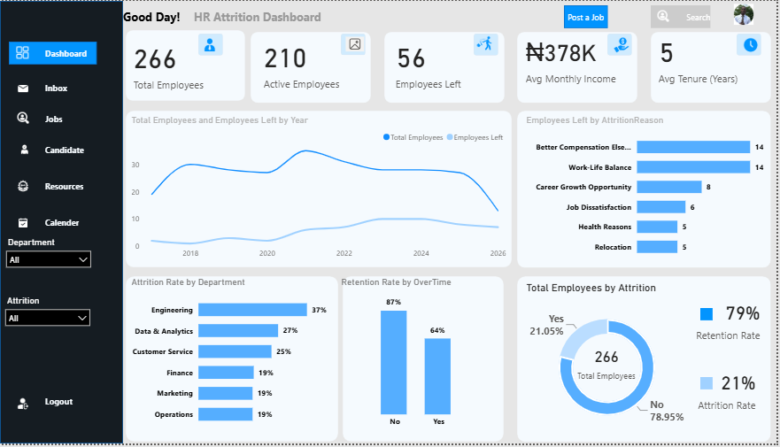

# HR Employee Attrition Dashboard

## Project Overview

This project involved developing an interactive HR analytics dashboard to provide a clear view of employee retention, attrition, and workforce trends.

The dashboard brings together key workforce metrics and visual analysis to help understand employee movement, departmental attrition, employee tenure, income, and reasons for employee departures.

## Business Objective

The objective was to create a visual HR reporting solution that enables stakeholders to:

- Monitor employee headcount
- Track active employees and employees who left
- Measure retention and attrition rates
- Analyze attrition across departments
- Examine employee departures over time
- Understand reasons for employee attrition
- Review employee tenure and income metrics

## Key Performance Indicators

| KPI | Result |
|---|---:|
| Total Employees | 266 |
| Active Employees | 210 |
| Employees Left | 56 |
| Average Monthly Income | ₦378K |
| Average Employee Tenure | 5 Years |
| Retention Rate | 79% |
| Attrition Rate | 21% |

## Analysis Areas

- Departmental Attrition
- Attrition by Year
- Attrition Reasons
- Retention Analysis
- Employee Tenure
- Income Analysis

## Tools & Skills Demonstrated

- Microsoft Power BI
- Data Analysis
- Data Modeling
- Dashboard Development
- Data Visualization
- KPI Reporting
- HR Analytics
- Trend Analysis
- Business Intelligence

## Dashboard Preview

## Project Outcome

The dashboard provides a consolidated view of workforce retention and attrition metrics, helping users monitor employee movement and explore patterns within the workforce data.

## Author

**ThankGod Timipere Austin**

Data Analyst | Excel & Power BI | SQL | Business Intelligence
